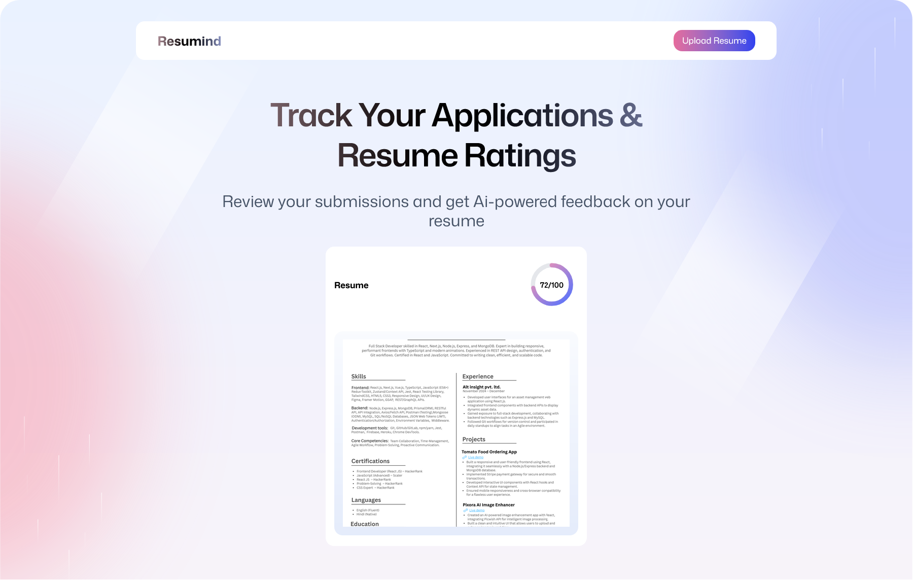
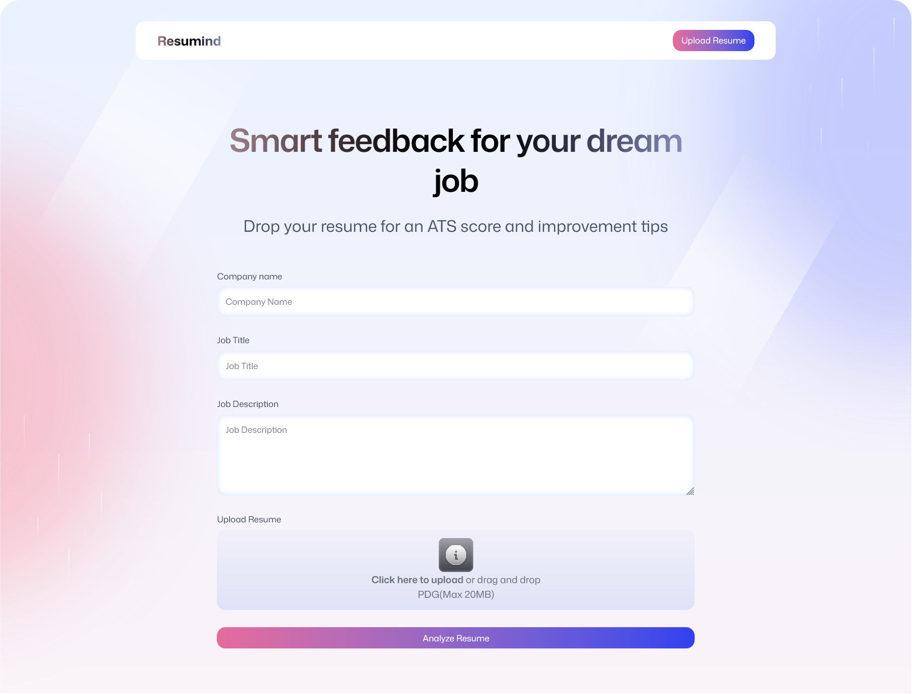
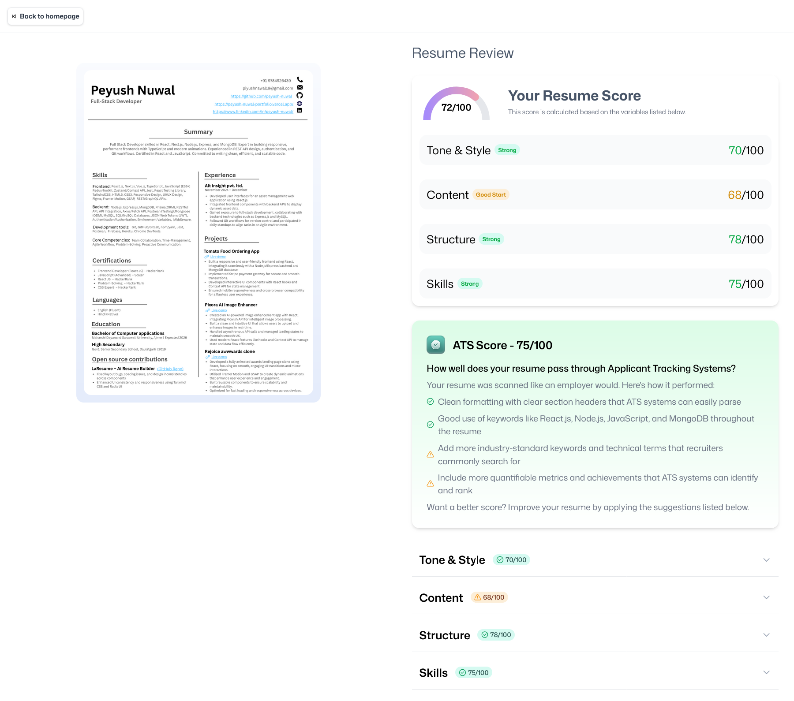

# 🚀 ResuMind AI – Smart Resume Analyzer
🔗 **Live Demo**: [https://resumind-ai-resume-analzer.vercel.app/](https://resumind-ai-resume-analzer.vercel.app/)

🎯 **AI-powered tool to analyze your resume, optimize it for ATS, and get personalized, job-specific feedback — all in one sleek, modern app.**


<div align="center">


[](https://vercel.com/new/clone?repository-url=https://github.com/yourusername/resumind-Ai-resume-analzer)

</div>

---

## 📸 Screenshots

<div align="center">
  
  
  
</div>

---

## ✨ Features

### 🤖 AI-Powered Resume Analysis
- Smart resume scoring with actionable feedback
- ATS (Applicant Tracking System) optimization
- Checks tone, formatting, and structure
- Skill-to-job matching recommendations

### 📊 Visual & Detailed Feedback
- Overall score out of 100
- Sectional breakdown: Skills, Tone, ATS, Structure, Content
- Gauge-style score indicators
- Targeted suggestions to boost your score

### 🎯 Job-Specific Optimization
- Analyze based on job title & company
- Role-specific keyword scanning
- Tailored tips for specific industries

---

## 🧠 Tech Stack

<div align="center">


</div>


## 🧪 Quick Start

### Prerequisites
- Node.js v18+
- npm or yarn

### Local Setup
Follow these steps to get started with this template:

1. **Clone the repository**

   ```bash
   git clone https://github.com/peyush-nuwal/resumind-Ai-resume-analzer.git
   ```

2. **Navigate to the project directory**

   ```bash
   cd resumind-Ai-resume-analzer
   ```

3. **Install dependencies**

   ```bash
   npm install
   ```
   > Or use `yarn` or `pnpm` if you prefer.

4. **Start the development server**

   ```bash
   npm run dev
   ```


## 📬 Contact

Feel free to connect or reach out for collaboration, feedback, or just to say hi!  

- 🌐 **Portfolio**: [peyush-nuwal-portfolio.vercel.app](https://peyush-nuwal-portfolio.vercel.app)
- 🐙 **GitHub**: [github.com/peyush-nuwal](https://github.com/peyush-nuwal)
- 💼 **LinkedIn**: [linkedin.com/in/peyush-nuwal](https://www.linkedin.com/in/peyush-nuwal/)
- ✉️ **Email**: [piyushnawal19@gmail.com](mailto:piyushnawal19@gmail.com)
- 🐦 **Twitter/X**: [@Nuwal_Peyush](https://x.com/Nuwal_Peyush)
